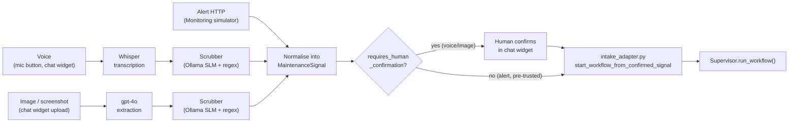
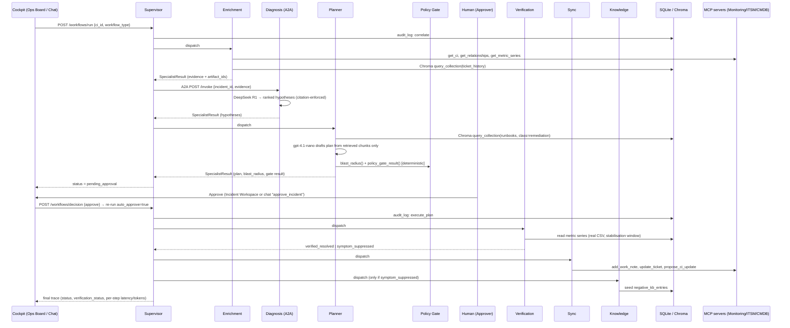
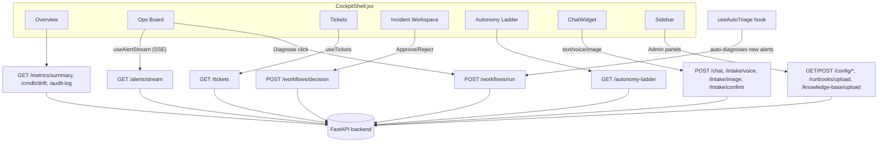

# OpsFlow — App & Data Flow

How data actually moves through the system, end to end, for each entry point. Pairs with
`ARCHITECTURE.md` (the "what") — this is the "where does the data go" doc.

---

## 1. The three intake paths → one canonical shape

Every incident, regardless of how it was reported, becomes the same `MaintenanceSignal` object
before anything else touches it:

```json
{
  "signal_id": "SIG-0001",
  "modality": "alert | voice | image",
  "extracted_text": "post-transcription/extraction, PRE-scrub",
  "candidate_ci_refs": ["CI-0087"],
  "candidate_alert_refs": ["ALERT-1043"],
  "confidence": 0.0,
  "requires_human_confirmation": true
}
```



**Rule that never bends:** the scrubber runs *after* modality conversion (transcription/extraction)
and *before* the signal enters any workflow or model call. Raw audio/images are held in memory for
the run only — never persisted to disk.

---

## 2. Inside one workflow run — the golden path (Incident Resolution)



Every arrow into `DB` from `Sup`/an agent is also an `audit_log` row: actor, action, target
artifact, evidence IDs, model used, timestamp — append-only, queried live by the Overview tab and
the Audit Log panel.

---

## 3. Where each number on the Overview tab comes from

Four endpoints fetched on load, every number computed **live** from real SQLite/dataset state —
nothing on this tab is canned:

| Endpoint | Feeds |
|---|---|
| `GET /metrics/summary` | Workflow runs, completed, human approvals/rejections, stopped-before-completion, negative-KB entries seeded, manual steps avoided, resolution-time averages |
| `GET /cmdb/drift` | Drift rate, CMDB accuracy donut — diffs `cmdb_ci` (recorded) vs `cmdb_ci_ground_truth` (actual) field by field |
| `GET /autonomy-ladder` | "Most-trusted runbooks" card |
| `GET /audit-log?limit=6` | Recent activity feed (role-gated to Approver/Admin) |

`metrics.total_workflow_runs_this_session` = `COUNT(audit_log WHERE action='correlate')` — one row
per real run, not a simulated counter. `manual_steps_avoided` sums the real `evidence_ids` list
length from every `execute_plan` row — a real count of runbook steps actually executed, not an
estimate.

---

## 4. Frontend data flow (who calls what)



One shared `useWorkflowRun` hook lives in `CockpitShell` and is passed to every tab that shows a
run — starting an incident from the Ops Board, the notification bell, or the chat widget all
converge on the same Incident Workspace state.

---

## 5. Auth flow

`POST /auth/login` → mock JWT carrying a `role` claim (`ops_engineer` / `approver` / `admin`) →
sent as `Authorization: Bearer <token>` on every call except `GET /alerts/stream` (SSE, token as a
query param since `EventSource` can't set headers). Role is enforced server-side (`require_role()`
in `main.py`) — the frontend role switcher is a display convenience, not the actual gate. Admin can
`POST /auth/view-as` to temporarily preview another role without losing their own identity (shown
honestly as "X viewing as Y", not silently swapped).

---

## 6. Failure / offline path

If `genailab.tcs.in` is unreachable mid-run, `get_llm()`/`get_embeddings()` transparently retry
against local Ollama (`llama-3.2-3b-it`) via LangChain `.with_fallbacks()` — the workflow keeps
running instead of hard-failing. This is invisible under normal conditions; it only shows up as
slightly higher latency on the step that triggered it.
